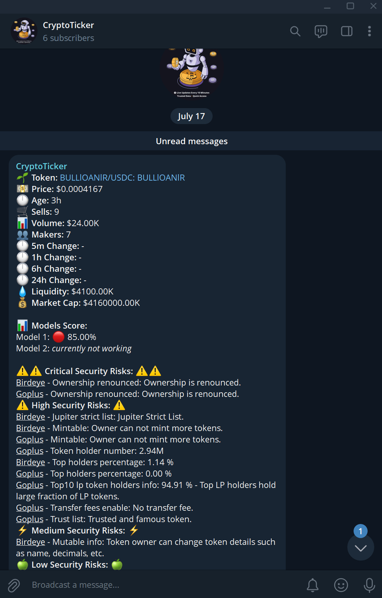
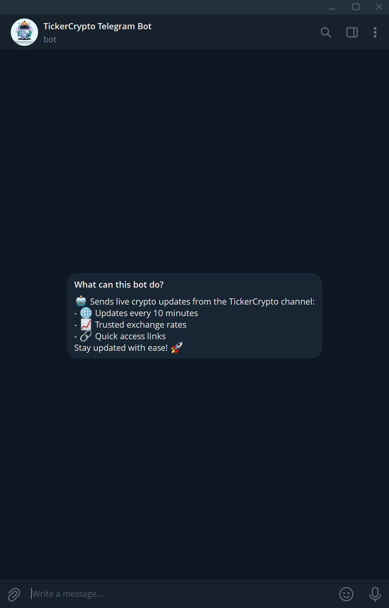
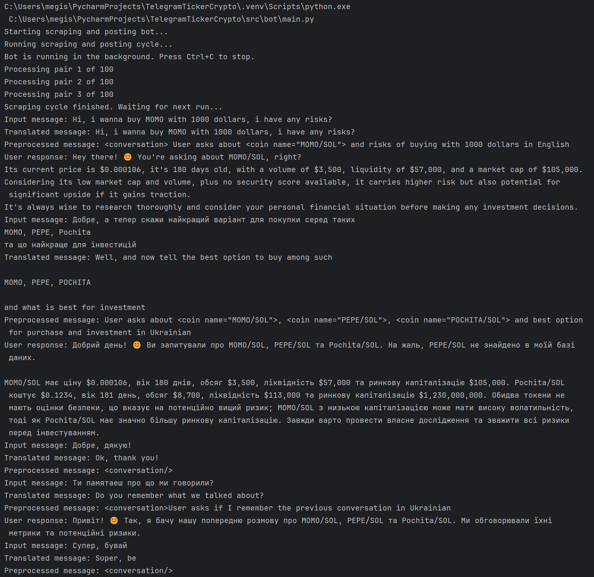
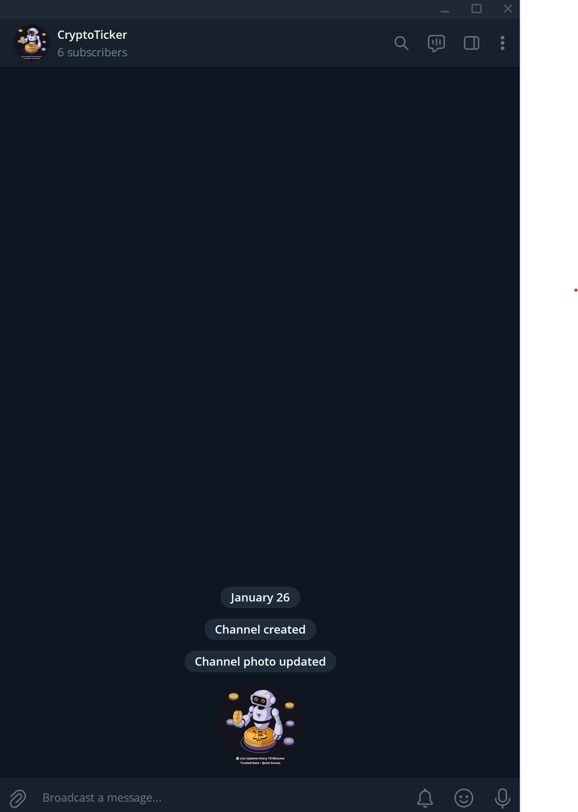

# CryptoTicker

###### &emsp;&emsp;&emsp;&emsp;&emsp;&emsp;&emsp;&emsp; - by [Mykyta Kyselov (TheMegistone4Ever)](https://github.com/TheMegistone4Ever).

CryptoTicker is a sophisticated, automated Telegram bot designed to navigate the fast-paced world of new
cryptocurrencies on the Solana network. It combines real-time web scraping, multi-platform security analysis, and a
conversational AI to provide users with timely data and risk assessments for newly launched tokens. The bot
automatically monitors new pairs, evaluates their security posture, and posts alerts about promising tokens to a
designated Telegram channel, while also allowing users to interact with it directly for inquiries.

## Video Demo

A live demonstration of the CryptoTicker bot in action, showcasing its channel posts and conversational AI capabilities.

[Watch the Demo on YouTube](https://youtu.be/xSQjNYPj0V8)

## Table of Contents

1. [Getting Started](#1-getting-started)
    1. [Project Overview](#11-project-overview)
    2. [Features](#12-features)
2. [Core Concepts & How It Works](#2-core-concepts--how-it-works)
    1. [The Scraping & Analysis Cycle](#21-the-scraping--analysis-cycle)
    2. [Conversational AI Assistant](#22-conversational-ai-assistant)
    3. [Security Scoring](#23-security-scoring)
3. [Prerequisites](#3-prerequisites)
    1. [System Requirements](#31-system-requirements)
    2. [Software Requirements](#32-software-requirements)
4. [Installation & Setup](#4-installation--setup)
    1. [Clone Repository](#41-clone-repository)
    2. [Setup Virtual Environment](#42-setup-virtual-environment)
    3. [Install Dependencies](#43-install-dependencies)
    4. [Configuration](#44-configuration)
5. [Running the Application](#5-running-the-application)
6. [Screenshots](#6-screenshots)
7. [Project Structure](#7-project-structure)
8. [Code Overview](#8-code-overview)
    1. [Core Bot Logic (`bot/`)](#81-core-bot-logic-bot)
    2. [Gemini AI (`gemini/`)](#82-gemini-ai-gemini)
9. [License](#9-license)

## 1. Getting Started

### 1.1 Project Overview

The CryptoTicker project was built to address the challenge of identifying credible new cryptocurrency projects amidst a
sea of scams and high-risk ventures. By automating the process of data collection and security vetting, it aims to
provide a filtered, data-driven feed of new tokens that meet a predefined set of security criteria. The system is
composed of two main parts: a background process that continuously scrapes, analyzes, and posts to a Telegram channel,
and an interactive Telegram bot that leverages Google's Gemini AI to answer user questions based on the collected data.

### 1.2 Features

* **Automated Token Scraping:** Periodically scrapes Dexscreener for new token pairs on the Solana network based on
  liquidity, age, and volume.
* **In-Depth Security Analysis:** For each token, it performs a security check using **Birdeye** and **GoPlus** APIs to
  identify potential risks like mintable contracts, renounced ownership, and honeypot indicators.
* **Custom Security Scoring:** A unique scoring model (`Model 1`) aggregates dozens of security data points from both
  Birdeye and GoPlus, assigning a weighted score to quantify the token's risk level.
* **Automated Telegram Channel Posts:** Tokens that pass a configurable security score threshold are automatically
  formatted into a detailed message and posted to a public Telegram channel.
* **Conversational AI:** A user-facing bot that uses Google's Gemini model to understand and respond to user queries in
  multiple languages.
* **Dialogue Act Classification:** Integrates NLTK to classify user intent (e.g., asking a question, saying goodbye),
  enabling more natural conversation management.
* **Data-Driven Responses:** The AI assistant can retrieve metrics for specific cryptocurrencies from a local database
  of previously scraped and analyzed tokens.
* **Multithreaded Architecture:** The channel posting and user-facing bot run in separate threads, ensuring the bot
  remains responsive to users while the scraping cycle runs in the background.

## 2. Core Concepts & How It Works

The project operates through a combination of a cyclical background task and a responsive message handler.

### 2.1 The Scraping & Analysis Cycle

1. **Scrape Dexscreener:** The `main_loop` in `main.py` periodically triggers the `scrape_dexscreener_data` function.
   This function uses `seleniumbase` to open Dexscreener and gather data on new token pairs, such as price, age, volume,
   and liquidity.
2. **Security Vetting:** For each token found, the `check_security_risks` function from `birdeye.py` is invoked. This
   function navigates to the token's security tab on Birdeye.so and scrapes detailed risk information from both Birdeye
   and its integrated GoPlus security report.
3. **Calculate Score:** The collected security data, which includes critical, high, medium, and low-level risks, is fed
   into the `calculate_token_score` function. This function uses the `SCORING_CONFIG` to apply negative weights for each
   identified risk, producing a final security score out of 100.
4. **Filter & Post:** The `should_post_token` function checks if the calculated score meets the required threshold (
   e.g., > 90%). If it does, `format_telegram_message` constructs a detailed, HTML-formatted message, which is then sent
   to the specified Telegram channel via `bot.send_message`.
5. **Persist Data:** All scraped token data is saved to `data/crypto_pairs.csv` to make it accessible to the
   conversational AI.

### 2.2 Conversational AI Assistant

1. **Message Handling:** The bot's `handle_messages` function in `main.py` listens for incoming user messages.
2. **Intent Classification:** The `CryptoAIProcessor` first uses the `ClassifierManager` (which leverages a pre-trained
   NLTK NaiveBayesClassifier) to determine the user's intent (e.g., `whQuestion`, `Bye`). This helps manage the
   conversation flow, such as starting or ending a session.
3. **Two-Stage Gemini Processing:**
    * **Technical Model:** The user's message is first sent to a "technical" Gemini model. This model is instructed to
      extract key entities like coin names (e.g., `<coin name="MOMO/SOL">`) and summarize the user's query in a
      structured format.
    * **User-Facing Model:** The structured output from the technical model, along with any retrieved data from
      `crypto_pairs.csv`, is then passed to a "user-facing" Gemini model. This model is instructed to generate a
      friendly, helpful response in the user's original language, using the provided data.
4. **Response:** The final, user-friendly response is sent back to the user in the Telegram chat.

### 2.3 Security Scoring

The heart of the bot's filtering logic is the custom scoring system defined in `scoring_config.py`. It assigns different
negative weights to various security issues based on their severity (Critical, High, Medium, Low) and the platform that
reported them (Birdeye or GoPlus).

* **Critical Risks** (e.g., `honeypot`, `owner can change balance`) have high negative weights, making it nearly
  impossible for a token with these issues to be posted.
* **High Risks** (e.g., `mintable`, `proxy contract`) significantly lower the score.
* **Medium and Low Risks** (e.g., `mutable info`, `anti whale`) have smaller impacts.

The final score is normalized to a percentage, providing a clear and quantifiable measure of a token's security posture.

## 3. Prerequisites

### 3.1 System Requirements

* **Operating System:** Windows, macOS, or Linux.
* **CPU:** A modern processor.
* **RAM:** 4GB+, 8GB recommended.
* A stable internet connection.

### 3.2 Software Requirements

* **Python:** Version 3.10 or newer.
* **Pip:** For installing Python packages.
* **Google Chrome:** Required by `seleniumbase` for web scraping.

## 4. Installation & Setup

### 4.1. Clone Repository

```bash
git clone https://github.com/TheMegistone4Ever/TelegramTickerCrypto.git
cd TelegramTickerCrypto
```

### 4.2. Setup Virtual Environment

It is highly recommended to use a virtual environment.

```bash
# Create a virtual environment
python -m venv .venv

# Activate the virtual environment
# On Windows:
.venv\Scripts\activate
# On macOS/Linux:
source .venv/bin/activate
```

### 4.3. Install Dependencies

Run the installation command:

```bash
pip install -r requirements.txt
```

After installation, run the following in a Python interpreter to download necessary NLTK data:

```python
import nltk

nltk.download("nps_chat")
nltk.download("punkt")
```

### 4.4. Configuration

The bot requires API keys and other configuration variables to be stored in a `.env` file in the project's root
directory.

1. Create a file named `.env` in the root of the project.
2. Add the following key-value pairs to the file:

```env
# Your Telegram bot token from BotFather
BOT_TOKEN="YOUR_TELEGRAM_BOT_TOKEN"

# The ID of the channel where alerts will be posted (e.g., @yourchannel or -100123456789)
CHANNEL_ID="YOUR_TELEGRAM_CHANNEL_ID"

# Path to a Chrome user profile directory for Selenium to maintain sessions/cookies
# Example for Windows: "C:\\Users\\YourUser\\AppData\\Local\\Google\\Chrome\\User Data"
USER_DATA_DIR="PATH_TO_YOUR_CHROME_USER_DATA_DIRECTORY"

# Your API key for the Google Gemini AI
GEMINI_API_KEY="YOUR_GEMINI_API_KEY"
```

## 5. Running the Application

Once the setup and configuration are complete, you can start the bot by running the `main.py` script from the `src/bot`
directory.

```bash
# Navigate to the correct directory
cd src/bot

# Run the main script
python main.py
```

The console will display logs indicating that the bot is running, the scraping cycle has started, and it is polling for
messages. The bot will now operate in the background and respond in Telegram.

## 6. Screenshots

**Example Channel Post**
*An alert posted by the bot in the Telegram channel, detailing a token's metrics and security analysis.*


**Bot Interaction**
*The initial welcome message from the bot in a private chat.*


**Under the Hood: AI Processing**
*Console output showing how the AI processes user messages in English and Ukrainian, identifying coin names and intent.*


**Channel Creation**
*The initial creation of the CryptoTicker channel in Telegram.*


## 7. Project Structure

```
TelegramTickerCrypto/               # Root directory of the project
├── .env                            # Environment variables for configuration
├── .gitattributes                  # Git attributes file
├── .gitignore                      # Specifies files and directories to ignore in Git
└── src/                            # Source code directory
    ├── bot/                        # Contains the main bot logic
    │   ├── data/                   # Directory for storing scraped data
    │   │   └── crypto_pairs.csv    # CSV file with scraped token data
    │   ├── downloaded_files/       # Directory for storing downloaded files
    │   ├── models/                 # Contains data models and configurations
    │   │   └── classifier.pickle   # Pre-trained NLTK NaiveBayesClassifier model
    │   ├── birdeye.py              # Scraping and security analysis logic for Birdeye.so
    │   ├── main.py                 # Main entry point of the bot application
    │   ├── models.py               # Data models and enums used in the bot
    │   ├── scoring_config.py       # Configuration for security scoring
    │   └── utils.py                # Utility functions for the bot
    └── gemini/                     # Contains the Gemini AI logic
        ├── assistant.py            # Main AI processor class for handling user queries
        ├── classifier_manager.py   # Manages the NLTK NaiveBayesClassifier for intent classification
        ├── custom_model.py         # Wrapper for the Google Generative AI model
        └── utils.py                # Utility functions specific to the AI, such as text translation and feature extraction
```

## 8. Code Overview

### 8.1 Core Bot Logic (`bot/`)

* **`main.py`**: The main entry point of the application. It initializes the TeleBot, starts the background scraping
  thread (`main_loop`), and sets up message handlers for user commands and general chat.
* **`birdeye.py`**: Contains the `check_security_risks` function, which uses `seleniumbase` to scrape security data for
  a token from Birdeye.so.
* **`utils.py`**: A collection of helper functions for tasks like number and string conversion (`string_to_number`),
  calculating the token score (`calculate_token_score`), and formatting the final Telegram message (
  `format_telegram_message`).
* **`models.py`**: Defines the `dataclasses` used throughout the project, such as `PairData`, `SecurityData`, and
  various `Enum`s for risk levels and time frames.
* **`scoring_config.py`**: Holds the configuration for the security scoring model. It defines the weights for each
  specific risk at different severity levels.
* **`data/`**: Stores the `crypto_pairs.csv` database of scraped tokens.

### 8.2 Gemini AI (`gemini/`)

* **`assistant.py`**: Contains the `CryptoAIProcessor`, the main class that orchestrates the AI's response generation.
  It manages the conversation state and coordinates the technical and user-facing models.
* **`custom_model.py`**: A wrapper class for the Google Generative AI model. It handles API calls, maintains
  conversation history (memory), and simplifies content generation.
* **`classifier_manager.py`**: Manages the NLTK NaiveBayesClassifier. It handles loading the pre-trained model (
  `classifier.pickle`) or training a new one if it doesn't exist. Its `is_types` function is used to check the intent of
  a user's message.
* **`utils.py`**: Contains utility functions specific to the AI, such as `translate_text` (for ensuring all text is
  processed in English) and `dialogue_act_features` (for feature extraction before classification).

## 9. License

The project is licensed under the [CC BY-NC 4.0 License](LICENSE.md).